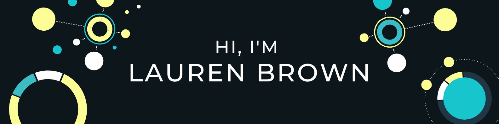

Hey there 👋🏽

I'm Lauren, a Full Stack Software Engineer who specializes in Front End development. I make it my mission to seamlessly convert user-centric designs into flawlessly executed websites or applications with lightning-fast speeds that are accessible to everyone.

<!-- Want to learn more about me? [Checkout My Portfolio](www.laurenche.com) -->

<!-- --- -->
<!-- #### 📝 Latest Blog Posts -->

---

### 📈 GitHub Stats:

## 

### 📍 Portfolio Project Pins

---

### ⚡️ **Programming Languages**

            

### 🛠️ **DevOps & Cloud ☁️**

      

---

